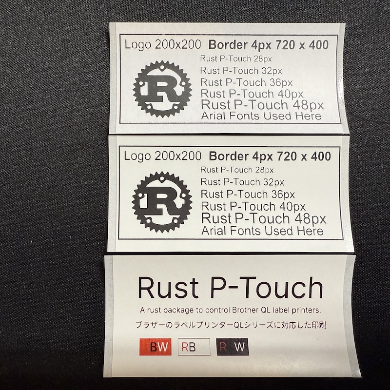

# ptouch

This crate provides raster printing capability for Brother P-Touch QL series label printers connected as USB device.
It allows to print programmatically generated label images.
Bunch of labels are represented as a struct implemnting `Iterator` trait which allows lazy generation.
The label data is represented as a two dimensional array, `Vec<Vec<u8>>`, conversion from other image formats can be easily done.
This driver supports printing with multiple printers at a same time.

## Features

- [x] Support USB connection
- [x] Print multiple labels at once.
- [x] High resolution printing support.
- [x] Improved print completion handling with smart status monitoring
- [x] Two colors printing support (QL-820NWB).
- [x] Support multiple printers on one computer.

## Print Samples

Here are some examples of labels printed with this library:



The samples show:
- **Top two labels**: Single-color black printing with Rust logo and various font sizes
- **Bottom label**: Two-color printing (black and red) demonstrating the library's capabilities on QL-820NWB

## Usage

### Media Tape

Choose a media tape you want to use and install it in the printer, then specify the matching media.

```rust
let media = ptouch::Media::Continuous(ContinuousType::Continuous62);
```

Theare are two types of media tape, Continuous and DieCut, each one has several size variations. In this example we choose Continuous tape with 62mm width.

### Serial Number and Model

You can inspect USB ports by `lsusb -v` which will show something like follows where `iProduct` and `iSerial` are what we need.

```
Bus 001 Device 003: ID 04f9:209b Brother Industries, Ltd 
Device Descriptor:
  bLength                18
  bDescriptorType         1
  bcdUSB               2.00
  bDeviceClass            0 (Defined at Interface level)
  bDeviceSubClass         0 
  bDeviceProtocol         0 
  bMaxPacketSize0        64
  idVendor           0x04f9 Brother Industries, Ltd
  idProduct          0x209b 
  bcdDevice            1.00
  iManufacturer           1 Brother
  iProduct                2 QL-800
  iSerial                 3 000G0Z000000
```

### Environment Configuration

To avoid hardcoding sensitive printer serial numbers in your code, use environment variables:

1. **Copy the example environment file**:
```bash
cp .env.example .env
```

2. **Edit `.env` with your printer information**:
```bash
# Set your actual printer information
DEFAULT_MODEL=QL820NWB
SERIAL=your_actual_serial_here
```

3. **Examples automatically load configuration**:
All examples now read printer configuration from environment variables, so you don't need to modify code with your serial numbers.

With these information we can initialize our configurations as follows.

```rust
let config: Config = Config::new(Model::QL800, "000G0Z000000".to_string(), media)
	.high_resolution(false)
	.cut_at_end(true)
	.two_colors(false)
	.enable_auto_cut(1);
```

These are default settings, `high_resolution` and `two_colors` options work but you need to provide appropriate data.

### Two-Color Printing (QL-820NWB)

For two-color printing with red and black colors, enable the `two_colors` option and use compatible red/black tape:

```rust
let config: Config = Config::new(Model::QL820NWB, "serial".to_string(), media)
    .two_colors(true)  // Enable two-color printing
    .high_resolution(false)
    .cut_at_end(true)
    .enable_auto_cut(1);
```

### Label Image Data

This part is tricky, since this crate provides only printing capabilities, label data must be prepared with compatible format. As shown in the printer manual, QL series expects image data with a 1bit index bitmap split by lines in an appropriate orders. Please see the manual for more detail.

In this example we create an image data with 720 x 400 px size by using an application. Then using `image` crate to read and convert it to a grayscale data. Then using `step_filter_normal` function, which is supplied with this crate, we binalize and pack bits 90 bytes width vector data.

```rust
let file = "examples/rust-logo.png";
let image: image::DynamicImage = image::open(file).unwrap();
let (_, length) = image.dimensions();
let gray = image.grayscale();
let mut buffer = image::DynamicImage::new_luma8(ptouch::WIDE_PRINTER_WIDTH, length);
buffer.invert();
buffer.copy_from(&gray, 0, 0).unwrap();
buffer.invert();
let bytes = buffer.to_bytes();
let bw = ptouch::utils::step_filter_normal(80, length, bytes);
```

#### Two-Color Image Data

For two-color printing, you can either:

1. **Convert RGB images automatically**:
```rust
let rgb_img = image::open("image.png")?.to_rgb8();
let (width, height) = rgb_img.dimensions();
let two_color_data = ptouch::convert_rgb_to_two_color(width, height, rgb_img.as_raw())?;
```

2. **Create TwoColorMatrix manually**:
```rust
let two_color_data = ptouch::TwoColorMatrix::new(black_matrix, red_matrix)?;
```

The color detection automatically identifies:
- **Red pixels**: R > 200, G < 100, B < 100
- **Black pixels**: Brightness < 128 (excluding red pixels)
- **White pixels**: Everything else (not printed)

#### Tips for creating data

In this crate, the width of image data must be 720px, which is the number of pins the printer have. The length varies depending on the label media. For the DieCut labels, there is a specif value. In case of the Continous labels, you can choose any length between 150px to 11811px for normal resolution (for 300 dpi). If you are specifying high_resolution or two_clolors options, it must be halved. After determing the size, place your contets in the area where actual labels go through. If you are using 62mm media, full width will be printed. But for 29mm media, you need to give an offset of 408 pixel on the left side then place content in 306 pixel width. You can check the details of media specification in the manual.

### Printing

Once you get the bitmap data, you can supply them as a Vec.

**Single-color printing**:
```rust
match Printer::new(config) {
    Ok(printer) => {
        printer.print(vec![bw.clone()]).unwrap();
    }
    Err(err) => panic!("Printer Error {}", err),
}
```

**Two-color printing**:
```rust
match Printer::new(config.two_colors(true)) {
    Ok(printer) => {
        printer.print_two_color(vec![two_color_data].into_iter()).unwrap();
    }
    Err(err) => panic!("Printer Error {}", err),
}
```

If the configuration value is invalid the `new` function will return an error.

Note: When sending a long label, rusb will timeout and return error. The maximum length is around 1000mm for continuous labels.

### Print Completion Monitoring

The library now features improved print completion handling with adaptive status monitoring. When a print job is sent, the library:

- Monitors printer status transitions intelligently
- Detects errors immediately during printing
- Waits for proper completion (Printing → Receiving state transition)
- Provides detailed debug logging for troubleshooting
- Includes timeout protection to prevent indefinite waiting

This improvement reduces unnecessary waiting time and provides better error detection compared to the previous fixed retry approach.

## Supported Printers

The following models are tested by myself. 

- QL-720NW
- QL-800
- QL-820NWB

Anothre printers listed in the `ptouch::Model` should also work but we might need to some tweaking.

## Tools

In the example, there is a small tool to read the printer status.

```
RUST_LOG=debug cargo run --example read_status
```

### Two-Color Printing Examples

Test two-color printing with built-in test patterns:

```
RUST_LOG=debug cargo run --example print_two_color test
```

Print RGB images as two-color labels:

```
RUST_LOG=debug cargo run --example print_two_color image path/to/your/image.png
```

This will show something like follows.

```
[2020-10-27T06:05:45Z DEBUG ptouch::printer] Raw status code: [80, 20, 42, 34, 38, 30, 0, 0, 0, 0, 1D, A, 0, 0, 14, 0, 0, 0, 0, 0, 0, 0, 0, 0, 0, 1, 0, 0, 0, 0, 0, 0]
[2020-10-27T06:05:45Z DEBUG ptouch::printer] Parsed Status struct: Status { model: QL800, error: UnknownError(0), media: Some(Continuous(Continuous29)), mode: 0, status_type: ReplyToRequest, phase: Receiving, notification: NotAvailable }
```

Some gathered data are saved in `printer_status.txt`.

## Recent Improvements

### v0.2.0 - Two-Color Printing Support

- **Two-Color Printing**: Full support for red and black printing on QL-820NWB
- **TwoColorMatrix**: New data structure for handling black and red image data separately
- **RGB Image Conversion**: Built-in function `convert_rgb_to_two_color` for automatic color separation
- **Smart Color Detection**: Automatic identification of red (R>200,G<100,B<100) and black (brightness<128) pixels
- **Print Command Enhancement**: New `print_two_color()` method with alternating raster line processing
- **Correct Image Orientation**: Fixed pixel ordering to match existing single-color printing behavior
- **Example Application**: Complete two-color printing example with test patterns and RGB image support

### v0.1.2 - QL-800 Compression Support Fix

- **QL-800 Compression Override**: Automatic disabling of compression mode for QL-800 model due to hardware limitations
- **Warning Logging**: Added warning message when compression is requested for QL-800 but disabled automatically

### v0.1.1 - Enhanced Print Completion Handling

- **Smart Status Monitoring**: Replaced fixed 3-retry approach with adaptive status polling
- **Improved Error Detection**: Immediate detection of printer errors during print jobs
- **State Transition Verification**: Proper monitoring of Printing → Receiving state transitions
- **Reduced Latency**: Optimized waiting times and eliminated unnecessary delays
- **Enhanced Debugging**: More detailed logging for print job monitoring and troubleshooting

### Error Handling Enhancements

The library now includes enhanced error types for better debugging:

- `PrintTimeout`: Triggered when print completion takes longer than expected
- `UnexpectedPhase`: Indicates unexpected printer state transitions
- `PrinterError`: Immediate detection of hardware-level errors (cover open, media issues, etc.)

## Todos

- [x] Better error handling and reporting for print completion
- [] Better error handling for when label ends
- [] Binalization with dithering support
- [x] Two colors printing support

## Tips

### Allow access to USB port on ubuntu

For my system with ubuntu 18.04 on Raspberry Pi 4, I got an error about permission to `/dev/usb/lp0`. To fix that I needed to add something like follows.

Add the current user to `plugdev` group.

```sh
$ sudo gpasswd -a $USER plugdev
```

Add a new rule as `/etc/udev/udev/rules.d/65-ptouch.rules`. Here the number in filename must be higher than 60 to be effective.

```sh:/etc/udev/rules.d/65-ptouch.rules
SUBSYSTEMS=="usb", ATTRS{idVendor}=="04f9", ATTRS{idProduct}=="209b|209c|209d", MODE="664", GROUP="plugdev"
```

Reload the rules.

```
sudo udevadm trigger
sudo udevadm control --reload-rules
```

Also if you are using Ubuntu 21.10, we need to install extra packages as follows.

```
sudo apt install linux-modules-extra-raspi
sudo reboot
```

https://static.dev.sifive.com/dev-tools/FreedomStudio/2019.08/freedom-studio-manual-4.7.2-2019-08-1.pdf

https://gill.net.in/posts/reverse-engineering-a-usb-device-with-rust/


## License

MIT
